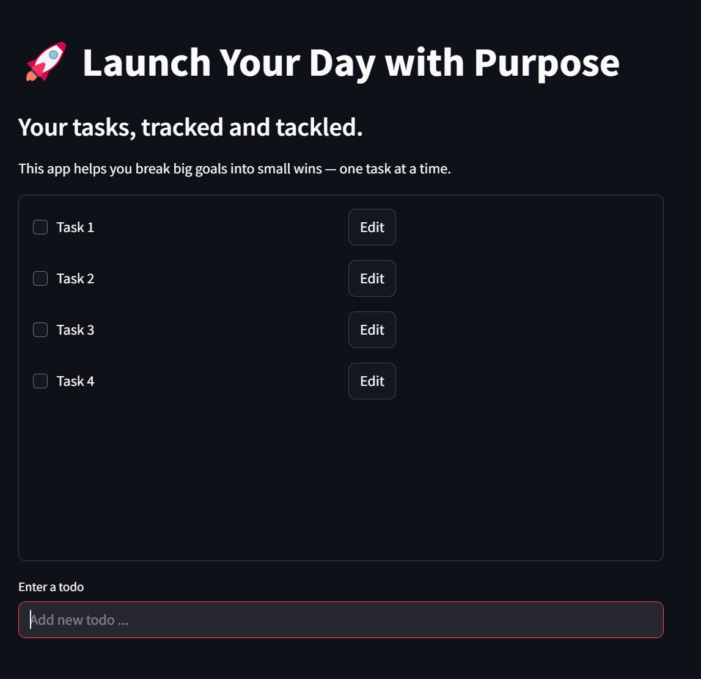
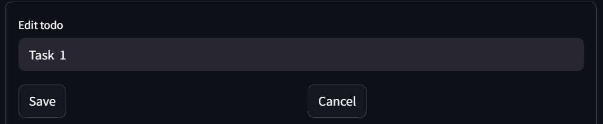

# ✅ To-Do List App – Launch Your Day with Purpose

🔗 **Live Demo**: [Click here to use the app](https://bayram-aliyev-todolist.streamlit.app)

A simple and clean **Streamlit-based To-Do app** that helps you stay organized, productive, and on track — one task at a time.

---

## 🚀 Features

- Add new tasks
- Edit existing tasks
- Mark tasks as complete (checkbox)
- Save tasks to a `todos.txt` file for persistence
- Smooth, responsive UI using Streamlit
- Inline editing and real-time updates

---

## 📸 Screenshot

*To-Do List*


*Editing todo*

---

## 🧰 Tech Stack

- **Frontend & UI**: [Streamlit](https://streamlit.io)
- **Backend**: Python
- **Storage**: Local `.txt` file (plain text)

---

## 📁 File Structure

```bash
├── web.py             # Streamlit front-end (main app)
├── functions.py       # File I/O helper functions
├── todos.txt          # Persistent task storage
├── requirements.txt   # Python dependencies
```

---

## ⚙️ Installation & Running Locally

### 1. Clone the repository

```bash
git clone https://github.com/your-username/todo-app.git
cd todo-app
```
### 2. Install dependencies

```bash
pip install -r requirements.txt
```
### 3. Run the app
```bash
streamlit run web.py
```

---

## 📝 Usage

- Enter a new task in the input field at the bottom
- Click the checkbox to mark a task as complete (task will be removed)
- Click **Edit** to modify an existing task
- All updates are saved automatically to `todos.txt`

---

## 📦 Dependencies

This app requires the following Python package:

```txt
streamlit
```
To generate a requirements.txt file yourself:

```bash
pip freeze > requirements.txt
```

---

## 🌐 Live Deployment (Streamlit Cloud)

This app is deployed and accessible online via Streamlit Cloud.

🔗 **Live Demo**: [https://bayram-aliyev-todolist.streamlit.app](https://bayram-aliyev-todolist.streamlit.app)

To deploy your own:

1. Push your code to a GitHub repository
2. Go to [streamlit.io/cloud](https://streamlit.io/cloud)
3. Create a new app and select `web.py` as the main file
4. Click **Deploy**

---

## 📫 Contact

Created by **Bayram Aliyev**

- 📧 Email: aliyevbayram08@gmail.com  
- 🔗 LinkedIn: [linkedin.com/in/your-profile](https://www.linkedin.com/in/bayram-aliyev/)

## 📝 License
This project is licensed under the MIT License. You are free to use, modify, and distribute it.

